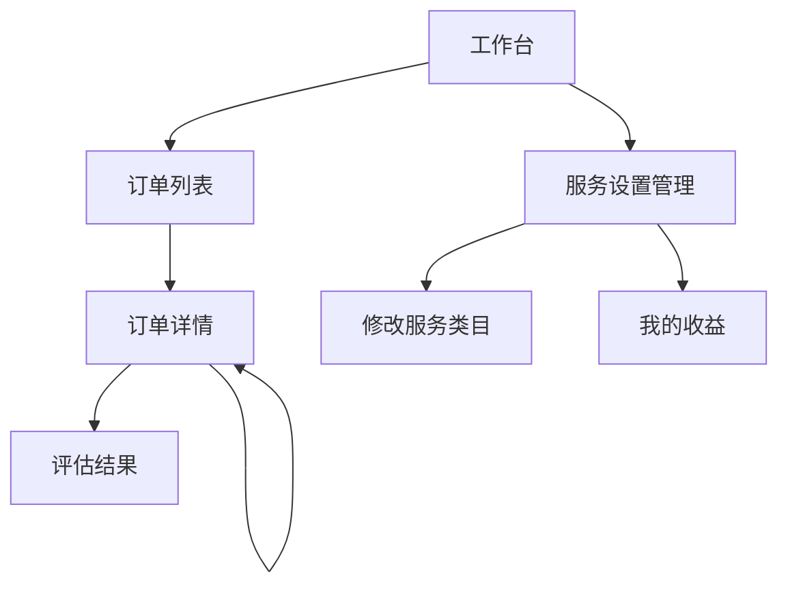
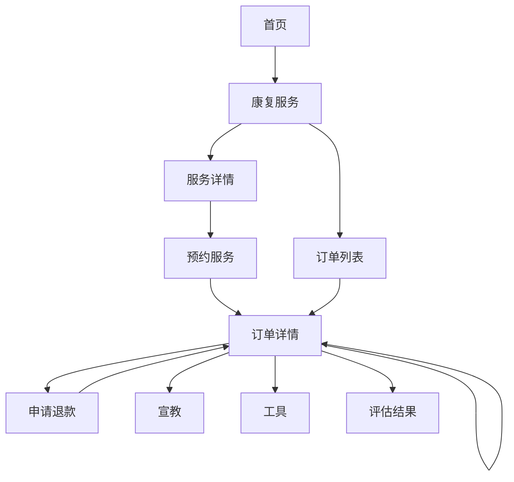

# 合肥B/C前端指令设计
[TOC]

------
## 引言
该文档为合肥B/C端初步指令设计，根据最新的UI将必需要重用的指令进行提取，并在页面文档部分以***指令(指令名)***的方式进行引用
## 指令设计
### 服务信息

只显示缩略图／标题／金额
### 订单信息

**继承服务信息**
状态显示／按钮显示不根据状态判断，由后台为状态／按钮提供字段控制；描述显示全部，不做两行自动...；注意提供参数显示状态右侧‘>’/显示服务详情/超链接/操作区域
### 可服务项

**继承服务信息**
点击开关向服务器发送请求；服务描述CSS控制两行...，点击隐藏／添加CSS实现卷展
### C端小服务列表

### C端大服务详情

描述显示全部，不做两行自动...
### 服务内容

可显示／隐藏状态，根据服务器字段显示对应状态，点击后展开服务内容详情，B端显示操作按钮，左侧123用普通数字字体即可。
### 用户退款

### 订单已关闭／取消／运营介入

根据服务器返回字段显示标题和描述
### 患者评价

星用background实现，两个图层叠加，前面的图层设置宽度覆盖后面的即可；评价详情做2行...的卷展
### 服务护士

### C端新tabbar1

C端根据hospital进行判断来应用新tabbar
### C端新tabbar2

### C端新首页工具

替换现有C端首页工具，添加咨询护士

##B 端
### 页面流转

### 工作台

与现有B端工具并列，resolve内请求接口决定显示工具页
### 订单列表

两个状态分别请求接口显示数据；待接单列表需要显示接单按钮，已经单内无按钮。
#### 相关指令：   
订单列表 |  
--------- |  
...(切换状态) |  
指令(订单信息)|  

### 订单详情

服务详情不做两行...;根据后台字段是否为undefined来显示字段对应指令，当全部操作已完成时显示完成订单；部分操作需要弹出确认框／输入框。
#### 相关指令
订单详情 |  
--------- |  
指令(订单信息)| 
指令(服务内容)| 
指令(用户退款)|  
指令(用户评价)|  
指令(运营介入)|  
指令(订单已关闭)|  
指令(订单已取消)|  
...(操作)|  
### 服务设置管理

评价详情做两行...卷展
#### 相关指令
服务设置管理 |  
--------- |  
...(操作)| 
指令(患者评价)| 
### 修改服务类目

评价详情做两行...卷展
#### 相关指令
可服务项目 |  
--------- |   
指令(可服务项)| 
### 我的收益
待定
### 评估结果
略
## C端
### 页面流转

### 首页

康复服务详情超过一行...；康复工具需更新；首页/康复工具/我的都添加接口字段控制康复服务的显示／隐藏。
#### 相关指令
首页 |  
--------- |  
...(无修改) |  
指令(C端新首页工具)| 
指令(C端小服务列表)|  
...(无修改)|  
指令(C端新tabbar1)|  
### 康复服务

banner和banner上文字后台分别提供字段
#### 相关指令
康复服务 |  
--------- |  
...(Banner图) |  
指令(C端小服务列表)|  
指令(C端新tabbar2)|
### 服务详情

#### 相关指令
服务详情|  
--------- |   
指令(C端大服务详情)|  
指令(服务内容)|
...(立即预约)|
### 预约服务

表单的服务地址使用高德地图的地址选择功能；姓名／性别／年龄／电话在提交时存到localstorage且每次下单读取。
高德地图代码参照：https://github.com/Youhujia/YHZS-V0.8-html5/blob/master/assess/
register.html
https://github.com/Youhujia/YHZS-V0.8-html5/blob/master/js/mobile/app/assess/register.js
JS内Autocomplete.type需要查找高德地图API
#### 相关指令
预约服务 |  
--------- |   
指令(服务信息)|  
...(表单 可做个指令)|
...(金额／提交)|

### 订单列表

各个状态分别请求接口加载数据
#### 相关指令
订单列表 |  
--------- |  
...(切换状态) |  
指令(订单信息)|  
指令(C端新tabbar2)|

### 订单详情

**基本同B端，服务／订单无完成操作按钮，增加部分功能如服务护士和订单支付**
评价页和支付页已合并到详情页；宣教／工具可跳转到对应页面
#### 相关指令
订单详情 |  
--------- |  
指令(订单信息)| 
指令(服务内容)| 
指令(服务护士)|  
指令(用户退款)|  
指令(用户评价)|  
指令(运营介入)|  
指令(订单已关闭)|  
指令(订单已取消)|  
...(操作)|  

### 申请退款

#### 相关指令
申请退款 |  
--------- |  
...(退款原因)| 
...(退款金额)| 
...(退款说明)|  
...(提交)|  

