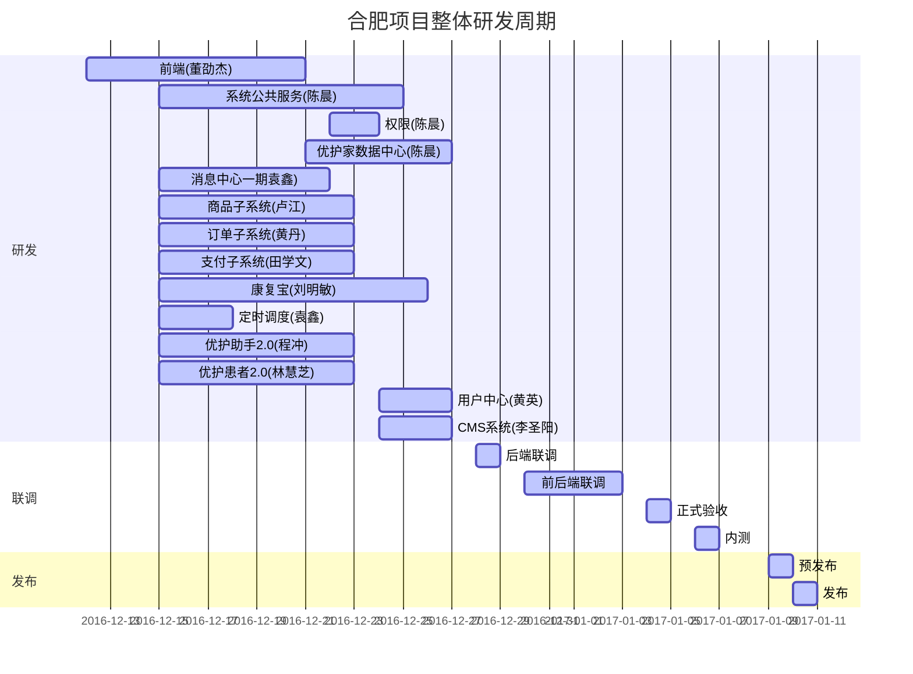

## 摘要
    
合肥项目启动相关内容
<!--more-->

## WIKI维护人
陈晨

## 人员分配
技术全员

## 时间点
项目大致分为三个阶段
- 研发
- 联调
- 发布

甘特图工具下方日期显示问题，这里单独列一下关键的时间点。

- 1228开发基本完成 最长子项目研发周期是11天
- 1229号开始后端内部联调
- 1230和0103两天前后端联调
- 0104和0105正式验收（产品/测试/交互）
- 0106和0107内测
- 0111正式发布

## 风险点
- 旧系统改造带来的旧产品的稳定性
- 工期紧张
- Buffer时间不充足，可能需要元旦加班

## 风险点

## 待启动项目
**注意P1是需要上线支撑的**
**按照总体的项目要求，项目的开发时间需要控制在五天内**

- 运营订单管理子系统-支持合肥项目订单管理 P1 @黄丹 @陈晨 @张正宇
- 财务子系统一期 P1 @黄丹 @陈晨 @张跃超
- 运维升级 P1 @田学文
- 服务标准化子系统一期 P2 
- 服务提供方管理子系统一期 P2
- 运营审核子系统一期  P3

## 正式立项推进的子项目

### 前端-B/C端对应合肥项目页面 
#### 人员分配
PM:董劭杰 
开发:李少华 高擎祖 李旭 董劭杰
Mentor:董劭杰
#### 时间点
人日：36人日（4x9）
开发完成：12-22
#### 详细内容
项目的详细设计，时间安排，相关疑问，需要PM在WIKI中更新，有疑问留言即可。

WIKI地址： [地址](http://wiki.office.test.youhujia.com/2016/12/12/HEFEI_NG_directive/)

### 系统公共服务二期-高频对象工厂/RPC调用易用性升级/并发&资源锁 
#### 人员分配
PM:陈晨 
开发:卢江 陈晨
Mentor:陈晨  
#### 时间点
人日：10人日
开发完成：12-21 
#### 详细内容
项目的详细设计，时间安排，相关疑问，需要PM在WIKI中更新，有疑问留言即可。

WIKI地址： [地址](http://wiki.office.test.youhujia.com/2016/12/14/architecture-halo/)

### 权限子系统二期-网关层接入患者身份校验/科室服务权限设置/旧C端流量转发改造  
#### 人员分配
PM&开发:陈晨 
#### 时间
人日：3人日
开发完成：12-24
#### 详细内容
项目的详细设计，时间安排，相关疑问，需要PM在WIKI中更新，有疑问留言即可。

WIKI地址： [地址](http://wiki.office.test.youhujia.com/2016/12/15/hefei-gateway-update3/)

### 优护家数据中心一期-数据记录/收集/标准化中间层 (代码层面记录/标准化数据设计) 
#### 人员分配
PM:陈晨
开发:黄丹 陈晨 
#### 时间
人日：7人日
应用系统开发完成：12-27
阿里云数据统一方案：12-27
全员配合统一升级配置：12-28
#### 详细内容
项目的详细设计，时间安排，相关疑问，需要PM在WIKI中更新，有疑问留言即可。

WIKI地址： [地址](http://wiki.office.test.youhujia.com/2016/12/15/youhujia-data-1/)

### 消息中心一期-短信/微信&APP PUSH/电话
#### 人员分配
PM:袁鑫
开发:袁鑫
Mentor:学文 陈晨 
#### 时间
人日：7人日
开发完成：12-22
#### 详细内容
项目的详细设计，时间安排，相关疑问，需要PM在WIKI中更新，有疑问留言即可。

WIKI地址： [地址](http://wiki.office.test.youhujia.com/2016/12/13/HeFei_push/)

### 商品子系统一期-落地优护家服务商品体系 
#### 人员分配
PM:卢江
开发:卢江
Mentor:田学文
#### 时间
人日：8人日
开发完成：12-23
#### 详细内容
项目的详细设计，时间安排，相关疑问，需要PM在WIKI中更新，有疑问留言即可。

WIKI地址： [地址](http://wiki.office.test.youhujia.com/2016/12/14/Hefei-product-system/)

### 订单子系统一期-通用订单模型产出/合肥订单系统支持
#### 人员分配
PM:田学文
开发:黄英 田学文
Mentor:田学文
#### 时间
人日：8人日
开发完成：12-23
#### 详细内容
项目的详细设计，时间安排，相关疑问，需要PM在WIKI中更新，有疑问留言即可。

WIKI地址： [地址](http://wiki.office.test.youhujia.com/2016/12/14/HeFei-order-system/)

### 支付子系统一期-通用支付模型/合肥支付支持
#### 人员分配
PM: 黄丹
开发: 黄丹 陈晨
#### 时间
人日：5人日
开发完成：12-20
#### 详细内容
项目的详细设计，时间安排，相关疑问，需要PM在WIKI中更新，有疑问留言即可。

WIKI地址： 
[支付系统API](http://wiki.office.test.youhujia.com/2016/12/11/payment_api/)
[支付系统设计框架](http://wiki.office.test.youhujia.com/2016/12/11/payment_overview/)
[支付系统设计概述](http://wiki.office.test.youhujia.com/2016/12/11/payment_overview/)
[支付平台接口说明](http://wiki.office.test.youhujia.com/2016/12/11/payment_service/)

### 康复宝（原 C端后台/模板子系统/模板管理系统）初步拆分
#### 人员分配
PM:刘明敏
开发:刘明敏 丁天奇 李圣阳
Mentor:刘明敏
#### 时间
人日：23人日
开发完成：12-28 三人并发 详细分工见详细内容的WIKI
#### 详细内容
项目的详细设计，时间安排，相关疑问，需要PM在WIKI中更新，有疑问留言即可。

WIKI地址： [地址](http://wiki.office.test.youhujia.com/2016/12/14/KFB-Refactor-Timeline/)

### 定时调度中心一期-支持合肥模式各种定时调度功能
#### 人员分配
PM:袁鑫
开发:袁鑫
Mentor:陈晨
#### 时间
人日：3人日
开发完成：12-17 
#### 详细内容
项目的详细设计，时间安排，相关疑问，需要PM在WIKI中更新，有疑问留言即可。

WIKI地址： [地址](http://wiki.office.test.youhujia.com/2016/12/14/timer_ design/)

### 优护助手2.0-支持合肥上门护理模式
#### 人员分配
PM:林慧芝
开发:王梦超 林慧芝
Mentor:陈晨
#### 时间
人日：8人日
开发完成：12-23
#### 详细内容
项目的详细设计，时间安排，相关疑问，需要PM在WIKI中更新，有疑问留言即可。

WIKI地址： [地址](http://wiki.office.test.youhujia.com/2016/12/14/HeFei-Project-B-End-Leitu/)

### 优护患者2.0-支持合肥上门护理模式
#### 人员分配
PM:程冲
开发:杨淑婷 程冲
Mentor:黄丹
#### 时间
人日：8人日
开发完成：12-23
#### 详细内容
项目的详细设计，时间安排，相关疑问，需要PM在WIKI中更新，有疑问留言即可。

WIKI地址： [地址](http://wiki.office.test.youhujia.com/2016/12/14/HeFei_C_End_Class_Diagram/)

### 用户中心三期-提供科室权限/护士接单权限/护士服务权限/用户体系迁移
#### 人员分配
PM:程冲
开发:杨淑婷 程冲
Mentor:黄丹
#### 时间
人日：8人日
开发完成：12-23
#### 详细内容
项目的详细设计，时间安排，相关疑问，需要PM在WIKI中更新，有疑问留言即可。

WIKI地址： [地址](http://wiki.office.test.youhujia.com/2016/12/14/HeFei_C_End_Class_Diagram/)

### 用户中心三期-提供科室权限/护士接单权限/护士服务权限/用户体系迁移
#### 人员分配
PM:黄英
开发:黄英
Mentor:田学文
#### 时间
人日：3人日
开发完成：12-28
#### 详细内容
项目的详细设计，时间安排，相关疑问，需要PM在WIKI中更新，有疑问留言即可。

WIKI地址： [地址](http://wiki.office.test.youhujia.com/2016/12/14/HeFei-order-authorization/)

### CMS系统升级-支持合肥服务标准化 
#### 人员分配
PM:李圣阳
开发:李圣阳
Mentor:刘明敏
#### 时间
人日：3人日
开发完成：12-28
#### 详细内容
项目的详细设计，时间安排，相关疑问，需要PM在WIKI中更新，有疑问留言即可。

WIKI地址： [地址](http://wiki.office.test.youhujia.com/2016/12/15/CMS-upgrade-hefei/)

预防渲染意外：

